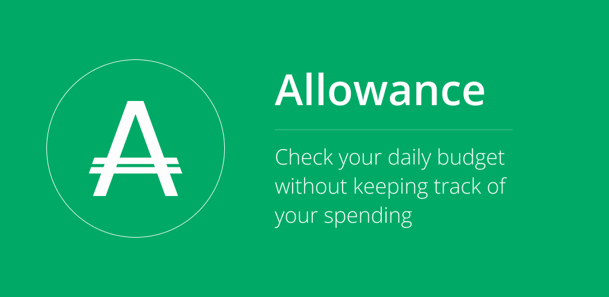
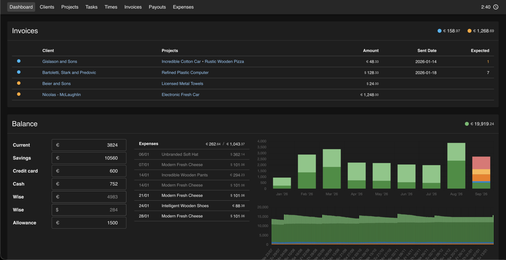
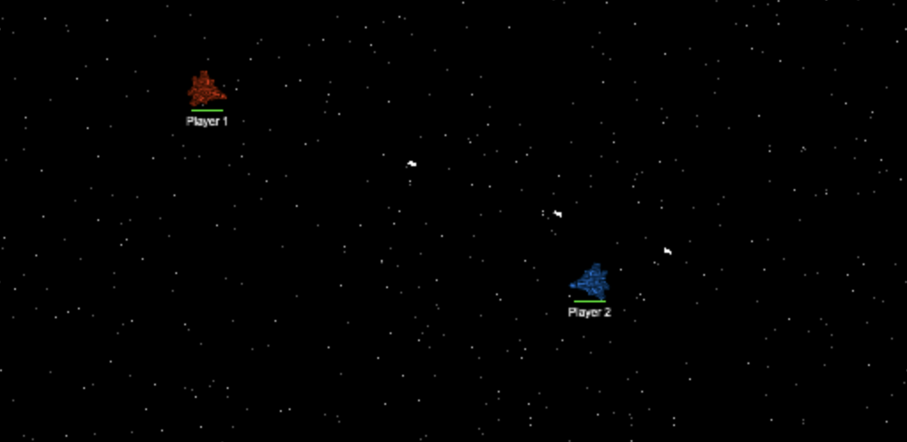

# Emre Koc

**Senior Software Engineer | Tech Lead**

I'm a Senior Software Engineer with nearly 20 years of experience creating web applications, including more than a decade leading teams as a Technical Lead.

The projects I've worked on for various companies over the years are on private repositories, so none can be showcased here. Below are some of my own public and private repositories I actively work on.

## Website 

[Repository](https://github.com/Emroni/website) | [Website](https://emrekoc.io)

Personal portfolio website showcasing my professional experience and technical skills.

## Allowance 

[Website](https://allowancebudgeting.com/) | [iOS App](https://apps.apple.com/us/app/allowance-budgeting/id6450614244) | [Android App](https://play.google.com/store/apps/details?id=io.emrekoc.allowance)

A budgeting app that allows users to manage their finances without having to keep track of every expense. Current live version uses [Firebase](https://firebase.google.com/), new version will be using a custom backend.

Consists of 3 private repositories:

- **App**: [React Native](https://reactnative.dev/) app made with [Expo](https://expo.dev/)
- **API**: [NestJS](https://nestjs.com/) backend, authentication using [Better Auth](https://www.better-auth.com/), connected to a [Postgres](https://www.postgresql.org/) database with [TypeORM](https://typeorm.io/)
- **Website**: [Next.js](https://nextjs.org/) web app, styled with [Material UI](https://mui.com/material-ui/)

## Admin 

My personal admin system. It holds all information of my clients, projects, and invoices, as well as my finances to keep track of my income, expenses, and total balance over time.

## Experimental 

[Repository](https://github.com/Emroni/experimental) | [Website](https://experimental.emrekoc.io)

Experimental digital artworks made with [Three.js](https://threejs.org/), [PixiJS](https://pixijs.com/), [GSAP](https://gsap.com/), and a lot of math.

## Arcade 

[Repository](https://github.com/Emroni/arcade) | [Website](https://arcade.emrekoc.io)

A real-time multiplayer space shooter game built with [PixiJS](https://pixijs.com/), [Socket.IO](https://socket.io/) and [Next.js](https://nextjs.org/). Players can join from their mobile devices to control spaceships in a shared arena, competing to shoot each other and climb the leaderboard.
